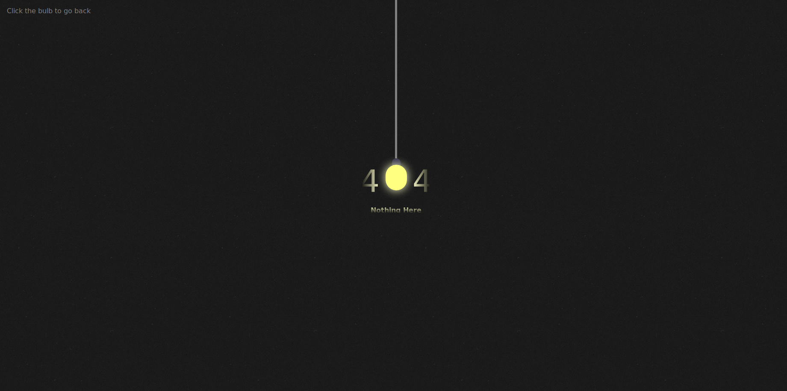
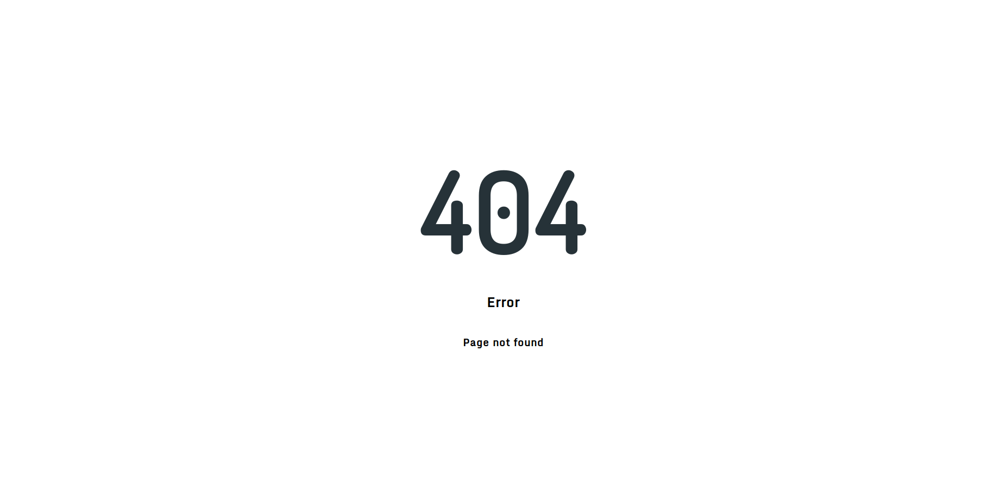

# 404
This is a collection of various 404 (Not Found) pages.
The focus at this point is to create simple pages (no large libraries or frameworks) that are visually creative.

## Check it out
Each page is completely encapsulated within its own folder.
To see any page, simply open its folder and view the index.html file in a browser.

----

## 404(1)
A light in the dark.
Hovering on the light causes it to glow brighter, a click will send you back to the previous page in your browser history.
I will potentially add animations to this

## 404(2)
Minimalist and professional.
